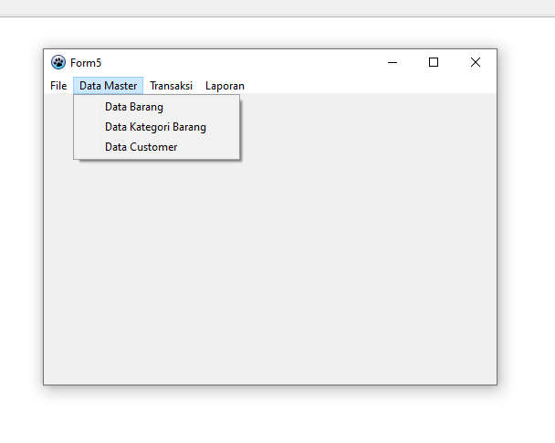
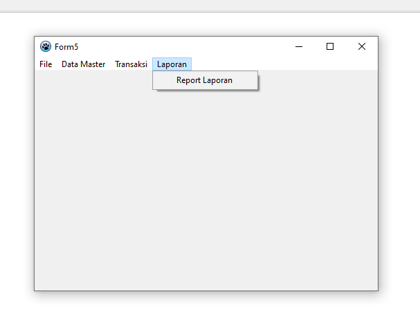

# UJIAN AKHIR SEMESTER - PEMROGRAMAN VISUAL

**Nama          : Aning Kinanti**  
**NIM           : 312010364**  
**Kelas         : TI.20.A.RPL.2**  
**Mata Kuliah   : Pemrograman Visual**  

## SISTEM INFORMASI PENJUALAN

## Login
  

## Main Menu
  

## Menu File
  

## Menu Data Master
  

### Form Data Barang
  

### Form Detail Data Barang
  

## Menu Transaksi
  

### Form Transaksi Penjualan
  

## Menu Laporan
  